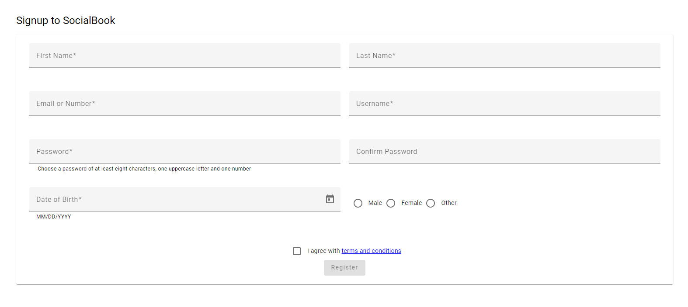
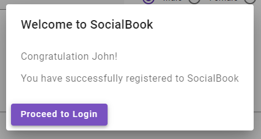

# Register Page

This document refers to our registration page on SocialBook.
Given the figma page below

You must create a page that has the following fields with their own validation rules and behavior rules:
 - First Name: required, takes any string of characters with lengths from 3 to 100
 - Last Name Name: required, takes any string of characters with lengths from 3 to 100
 - Email or Number: required, takes either a valid US format number (eg 12223334444) or a valid email address (eg. john.doe@example.com)
 - Username: required, takes only letters, numbers and the signs .-_
 - Password: required, valid for 8 characters or more, must include at least one uppercase and one number, can contain symbols, spaces etc
 - Confirm Password: required, must match Password field
 - Date of Birth: required, format is MM/DD/YYYY where MM is month with or without leading zero, DD is day of the month with or without leading zero, YYYY must be year. Date must be at least 18 years ahead of current time
 - Gender: required, one of the three options must be selected
 - Terms and Conditions checkbox: must be checked.

Other rules:
 - Register button has initial state _disabled_
 - Register button becomes _enabled_ ONLY when the form is valid (all the fields are valid)

Upon hitting the Register button, a pop-up will appear as displayed below

